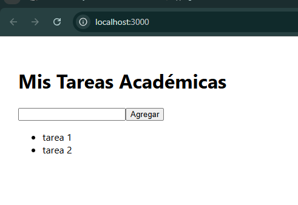
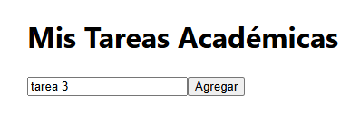
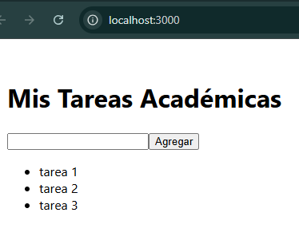

# Sistema de Tareas Académicas (Docker)

Aplicación web full-stack que demuestra cómo orquestar **Flask + PostgreSQL + React** con Docker Compose.

## 🚀 Cómo ejecutar

1. Clona el repo  
   ```bash
   git clone https://github.com/gustavorodri2011/docker-tareas-academicas.git
   cd docker-tareas-academicas

| Servicio      | Tecnología       | Puerto         |
| ------------- | ---------------- | -------------- |
| Frontend      | React + Nginx    | 3000           |
| Backend       | Flask + Gunicorn | 5000           |
| Base de datos | PostgreSQL 15    | 5432 (interno) |

## 📸 Capturas


